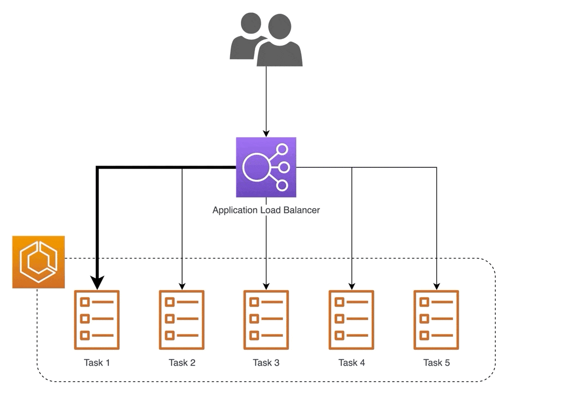
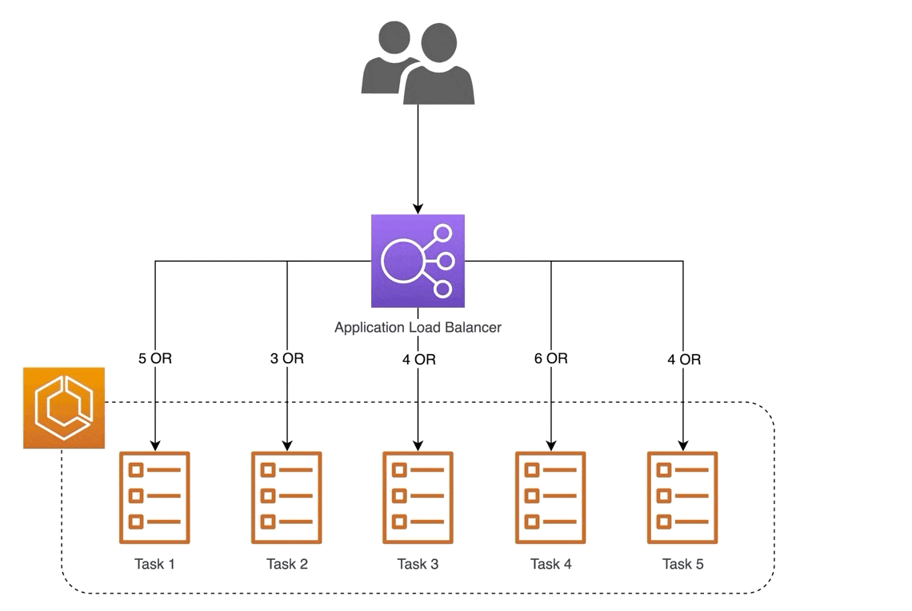
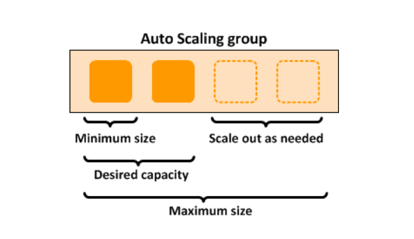

# 📝 Week 8 - Class notes
#### 📅 Date: 04.04.2023.

## Amazon Elastic Load Balancer
**Elastic Load Balancer (ELB)** ili samo **Load Balancer** preusmjerava saobraćaj/upućene zahtjeve ka **healthy  targets** tj. EC2 instancama registrovanim unutar **target groups** po portu i protokolu koji smo definisali pri kreiranju target group . 
Vršeći **health checks** LB provjerava status svake instance.
Ukoliko se poveća broj zahtjeva ka našoj aplikaciji, možemo **rucno** registrovati nove instance kako bismo uspjeli odgovoriti na sve zahtjeve. LB će, čim nova instanca bude u statusu *healthy* krenuti da šalje saobraćaj instanci.
Ako se zahtjevi ka aplikaciji smanje, možemo smanjiti broj instanci unutar target grupe, tako što radimo **deregister** čime se instanca uklanja iz target grupe i pri tome ne mijenjamo instancu.

Kako bismo automatizovali proces dodavanja instanci i terminiranja istih kada nam više nisu potrebne, koristimo **Amazon EC2 Auto Scaling** gdje kreiramo Auto Scaling grupu i za nju zakačimo željeni LB. 
O Auto Scaling grupama ce vise rijeci biti u nastavku.

**Bitno je napomenuti da LB, sam ne moze vrsiti terminiranje niti podizanje novih instanci, vec taj proces radimo manuelno dodajuci sami nove instance ili automatizovano koristeci Auto Scaling Groups.**

LB će saobraćaj preusmjeravati target grupama na osnovu pravila podešenih u **Listener rule** i time spriječiti neželjene upade, povećati bezbjednost aplikacije 

#### Load Balancer iz stvarnog zivota
Kada bismo Load Balancer uporedili sa nekim situacijama iz stvarnog zivota, onda mozemo objasniti rad Load Balancera na primjeru portira koji radi u banci.
* Load Balancer ce biti nas portir, koji stoji na ulazu u banku i regulise "saobracaj" klijenata sa zahtjevima. 
* Banka ima vise otvorenih saltera sa sluzbenikom u svakom, koji prihvataju zahtjeve klijenata. U ovom slucaju salteri sa sluzbenikom predstavljaju nase **EC2 instance**. 
* Salteri su podijeljeni u grupe - placanje racuna, isplata novca, krediti i sl. Svaka od ovih grupa saltera ima pravilo da se mogu raditi samo namjenske akcije, dakle na salteru placanje racuna, nije moguce podici kredit cime su uspostavljena odrednjena pravila. 
Ovako podijeljeni salteri cine zasebne **target grupe**
* Portir je upoznat sa prethodnim pravilom i zapisao je sebi gdje salje koje klijente. Ovo je ekvivalent **Listener rules** koji se postavljaju u **Listener** naseg Load Balancera.
* Kada klijent stigne do portira, pokaze mu svoje isprave i zahtjeve, koje portir provjeri u svojoj svesci i na osnovu zahtjeva i ispravnih dokumenata, proslijedi klijenta na odgovarajuci salter. U slucaju da klijent ne ispunjava neki od uslova, bice udaljen. Na ovaj nacin funkcionisu i pravi **requests** upuceni ka Load Balanceru, s tim da se provjerava port i protokol.
* Portir periodicno provjerava koji su sve salteri dostupni, vrseci tako **healt check**. Onog momenta kada se ustanovi da je jedan salter ostao bez sluzbenika, portir ce smatrati da je taj salter **unhealthy** i prestace da salje klijente na taj salter. Portir nema mogucnost da zatrazi da se otvori novi salter sa sluzbenikom, jer nije u njegovoj nadleznosti. 

Vec na samom pocetku smo vise puta ponovili termin **health check**, pa cemo u nastavku saznati nesto vise o tome.
### Health check
**Health check** su periodicni zahtjevi upuceni ka EC2 instancama. Onog trenutka kada jedna od instanci prestane sa radom, LB je oznacava kao `unhealthy` i prestaje sa prosljedjivanjem sadrzaja ka toj instanci. 
Postavljanjem LB-a ispred naših EC2 instanci, pravimo dodatni vid zaštite podataka, spriječavamo nedozvoljene pristupe i eventualne gubitke podataka. 

#### Health check strategije
Po default-u ASG koriste EC2 instance status check kako bi odredile "zdravlje" instance. Ovi status-check mogu identifikovati failure conditions - loss of connectivity, loss of system power, exhausted memory ili incompatible kernel. Dakle, ne prati se stanje unutar instance - status softvera, operativnog sistema ili file sistema koji smo instalirali na instanci.

Ukoliko ASG pridruzimo LB, omogucavamo time da ASG koristi LB health checks kako bi provjerila stanje EC2 instanci te podigla ili terminirala instance. 

Postoje tri strategije za mjerenje zdravlja instance:
1. **liveness checks**
2. **local health checks**
3. **dependency health checks**

Kako zelimo znati vise informacija o *health check* nase instance, preporuka je da se koriste **local health checks** tzv. **shallow health checks** ili **dependency health checks** tzv. **deep health checks**.

### Shallow health checks
* daju nam samo "on-box" checks kao sto je provjera kriticnih procesa i da li su agents u stanju running, da li je ponasanje softvera ispravno i zdravlje file sistema.
Instanca vraca uspjesan HTTP odgovor na health check ako je sve u redu.

### Deep health checks
* ukljucuju shallow health checks i test-interaction sa "off-box" dependencijes kao sto je razrjesavanje DNS record-a, querying database, slanje podataka ka downstream servisima ili external APIs.

Vise o ovoj temi mozete procitati na blog postu [Choosing the right health check with Elastic Load Balancing and EC2 Auto Scaling](https://aws.amazon.com/blogs/networking-and-content-delivery/choosing-the-right-health-check-with-elastic-load-balancing-and-ec2-auto-scaling/).

  
## Tipovi Load Balancer-a
U zavisnosti od potreba aplikacije  možemo koristiti jednu od 3 vrste Load Balancer-a.

### Application Load Balancer

**Application Load Balancer (ALB)** koristimo u slučaju kada radimo sa protokolima Aplikacijskog sloja OSI modela npr. kada trebamo prosljedjivati HTTP/HTTPS zahtjeve upucene nasoj aplikaciji.

*Slika preuzeta sa posta [What is an Application Load Balancer?
](https://docs.aws.amazon.com/elasticloadbalancing/latest/application/introduction.html)*

Upoznajmo se sa pojomovima:

* `listener` komponenta ALB koja slusa dolazeci saobracaj na definisanom `port`-u, kao sto je `port 80` za HTTP i `port 443` za HTTPS saobracaj. Moze biti konfigurisan na nacin da sadrzi vise `listener rules` za rutiranje saobracaja ka `target grupama`
* `Listener Rule` set pravila/uslova koja je potrebno ispuniti kako bi se saobracaj proslijedio odredjenoj `target grupi`
* `target group` ciljna grupa ili logicka cjelina EC2 instanci kojima ce ALB prosljedjivati svoje zahtjeve
* `target` EC2 instanca koja je registrovana unutar `target grupe`

Kada klijent posalje zahtjev ka ALB, `listener` osluskuje na unaprijed definisanom portu za protokol. Zahtjev koji stigne na navedeni port, obradjuje se u skladu sa uslovima u `listener rules` i ako ispunjava uslove, ALB ce proslijediti saobracaj odgovarajucoj `target grupi` koja sadrzi registrovane `targets` tj. EC2 instance koje prihvataju saobracaj. 

Sam pojam **load balancing** govori nam da se radi o balansiranju dolazećeg saobraćaja, za šta svi load balancer-i koriste odgovarajuće algoritme. Izbor pravog balancing algoritma direktno utice na performanse nase aplikacije. Najcesce koristeni su **Round-Robin** i **Least Outstanding Request**. 

**Round-Robin**
* najjednostavniji *sheduling* algoritam koji jednako distribuira dolazeće zahtjeve ka svim registrovanim EC2 instancama unutar `target group` vrseci ciklicne prolaze kroz EC2 instance

Na dijagramu ispod, prikazano je kako round-robin algoritam  prosljedjuje zahtjeve. U pocetku vidimo 5 EC2 instanci gdje svaka dobija po jedan zahtjev, a nakon što se doda nova, 6 EC2 instanca ona će dobiti zahtjev i krug se nastavlja dalje.

*Animacija preuzeta sa blog posta [AWS Application Load Balancer algorithms](https://medium.com/dazn-tech/aws-application-load-balancer-algorithms-765be2eca158)*

**Round-Robin pros | cons**

:white_check_mark: Jednostavan i lak za razumijevanje
:white_check_mark: Sve `targets` dobijaju jednak broj zahtjeva
:x: `targets` moraju biti iste velične i sličnih performansi
:x: Zahtjevi moraju imati isti `load` i `latency` što često nije moguće jer API dozvoljavaju više request metoda. Na primjer, `POST` metodi treba više vremena za procesuiranje podataka nego `GET` metodi.

**Least Outstanding Request (LOR)**
* *sheduling* algoritam koji provjerava trenutni `workload` svake EC2 instance unutar `target group` i bira onu instancu koja ima trenutno najmanji workload tj. najmanj broj neodgovorenih zahtjeva (*eng. outstanding request*) te moze obraditi dolazeci zahtjev najprije. 

Dijagram pokazuje kako LOR algoritam prosljedjuje zahtjeve. Prolazenjem kroz sve EC2 instance, provjerava se koja ima najmanji workload. U ovom slucaju je to EC2 instanca `TASK 2`. U slucaju kada se doda nova instanca, ista ce da primi sve dolazece zahtjeve dok ne bude jednaka po workload-u sa ostalim instancama tj. dok se ne postigne balans.

*Animacija preuzeta sa blog posta [AWS Application Load Balancer algorithms](https://medium.com/dazn-tech/aws-application-load-balancer-algorithms-765be2eca158)*

**LOR pros | cons**

:white_check_mark: Redukuje kasnjenje tj. `latency`
:x: problem kod dodavanja novih instanci, jer moze doci do `flood`- previse zahtjeva za obradu po instanci
:x: Health check moraju da se rade dovoljno brzo kako bi sprijecili da instanca koja ce uskoro biti terminirana, uspije dobiti zahtjev jer ima najmanji workload i brze odgovara

#### Promjena Routing algoritma

Deafultni routing algoritam pri kreiranju je Round Robin. Naravno, moguce je promijeniti algoritam u postavkama na sljedeci nacin:
1. Otvorimo Amazon EC2 konzolu 
2. U navigacionom panelu izaberemo **LOAD BALANCING** i izaberemo **Target Groups**
3. Izaberemo ime target grupe i otvorimo *details page*
4. Pod **Group details**, u sekciji **Attributes** izaberemo **Edit**
5. Na stranici **Edit attributes**, za *Load balancing algorithm* izaberemo RR ili LOR. 
6. Save changes

Za vise informacija mozete procitati clanak [Routing algorithm](https://docs.aws.amazon.com/elasticloadbalancing/latest/application/load-balancer-target-groups.html#modify-routing-algorithm)

Vise o routing algoritmima mozete procitati na blog postu [Load Balancing - SAM WHO](https://samwho.dev/load-balancing/)

### Network Load Balancer
**Network Load Balancer (NLB)** funkcionise na transportnom nivou OSI modela i prosljedjuje TCP/UDP saobracaj registrovanim `targets` kao sto su EC2 instance, *containers* i IP adrese, uspostavljanjem TCP/UDP konekcije izmedju klijenta i `targets`
* koristi se u slucaju kada imamo dio resursa na on-permises data-centru sto zahtjeva upravljanje TCP i UDP saobracajem
* NLB je u mogucnosti da podrzi milione zahtjeva po sekundi, s jako malim kasnjenjem 

### Gateway Load Balancer
**Gateway Load Balancer (GWLB)** radi na mreznom nivou OSI modela i omogucava izvrsavanje i skaliranje **3rd party appliances** - firewalls, intrusion detection systems, prevention systems

GLB ima dvije glavne komponente:
* **Gateway Load Balancer endpoints (GWLBE)** smjestenom u VPC-u u kojem zelimo pratiti saobracaj i moze se dodati u `route table` kao `next hop`. Uloga GWLBE jeste da preusmjeri paket ka GWLB koji ce daljim koracima proslijediti paket na provjeru. Takodje, ako je paket siguran za prosljedjivanje serveru tj. nasoj aplikaciji, GWLB ce paket vratiti ka GWLBE koji paket proslijedi dalje ka ALB-u a on dalje ka `target group`. 
* **Gateway Load Balancer (GWLB)** enkapsulira sav saobracaj koji ide od GWLBE ka `targets` koristeci **[GENEVE](https://datatracker.ietf.org/doc/html/rfc8926)** protokol.
**GENEVE** protokol omogucava da paketi ostanu nepromjenjeni, sa istim source IP, destination IP kao kada su i kreirane i poslate. To omogucava da security appliances urade pravu provjeru paketa podataka, izvrse analize i prilagode pakete po potrebi. 
## Amazon EC2 Auto Scaling
**Amazon EC2 Auto Scaling** pomaze nam da u svakom trenutku imamo dostupan odgovarajuci broj EC2 instanci kako bismo omogucili normalno funkcionisanje i visoku dostupnost aplikacije.
* **Auto Scaling group (ASG)** je kolekcija EC2 instanci, čiji broj odredjuje velicinu ASG-a na nacin da podesimo parametre:
`minimum number` kao najmanji broj instanci koje ASG moze imati, a to je po preporuci **2 EC2 instance**. 
`desired number` je broj EC2 instanci koje zelimo imati kreirane odmah na pocetku i cilj je odrzavati ovaj broj konzistentnim sto je vise moguce. Ovaj broj mora biti u rasponu **[ minimum number - maximum number )**
`maximum number` najveci broj instanci koje mozemo imati i ujedno maksimalna velicina ASG

*Slika preuzeta iz AWS documentation na [linku](https://docs.aws.amazon.com/autoscaling/ec2/userguide/what-is-amazon-ec2-auto-scaling.html)*

### Launch Template
Prije kreiranja Auto Scaling group potrebno je da kreiramo **Launch Template** sto predstavlja jedan vid sablona koji sadrzi informacije poput - ID AMI image, instance type u nasem slucaju `t2.micro`, key pair za login, security groups, EBS volume za podizanje EC2 instanci. 
Za razliku od `Launch Configuration`, `Launch Template` omogucava kreiranje vise verzija template-a.

### Auto Scaling Policies 
**Auto Scaling Policies** predstavljaju unaprijed definisane korake koji se izvrsavaju ako je neki od naznacenih uslova ispunjen, sto se odnosi na automatsko podizanje ili terminiranje EC2 instanci tzv. skaliranje kapaciteta Auto Scaling grupe.

U primjeru zadatka za TASK 7 upoznali smo se sa **Dynamic scaling policies** koji daje instrukcije EC2 Auto Scaling da prati naznacenu Cloud Watch metriku i definise koje akcije je potrebno preduzeti u slucaju kada CloudWatch Alarm bude u stanju  `Alarm`. 
EC2 Auto Scaling se brine o tome da kapacitet ASG nikada ne bude manji od `minimum size limit` i veci od `maximum size limit`. 
Kapacitet se mjeri na dva nacina: 
1. **Capacity in terms of instances** gdje se radi sa brojem instanci koje se dodaju ili terminiraju
2. **Capacity units ( instance weighting is applied)** kada se radi o tezini tj. unaprijed definisanim vrijednostima kapaciteta `vCPU` i `Memory`. 
Vise o *instance weighting* procitati [ovdje](https://docs.aws.amazon.com/autoscaling/ec2/userguide/ec2-auto-scaling-mixed-instances-groups-instance-weighting.html)

**Tipovi Dynamic scaling policies**
1. **Target tracking scaling** - povecava i smanjuje trenutni kapacitet ASG na osnovu Cloud Watch metrike i `target value`. 
Na primjer, kao `target metric` mozemo postaviti `CPUUtilization` i staviti `50%` sto znaci da kada CPU bude preko 50% potrebno je da scaling policy poveca broj instanci unutar ASG kako bi se CPU smanjio i odrzavao na vrijednosti sto blizoj 50%. Suprotno, ako CPU padne ispod 50%, potrebno je terminirati instance do broja oznacenog kao `minimum number`. 
2. **Step scaling** - povecava i smanjuje trenutni kapacitet ASG na osnovu `step adjustments`. Definisemo speficicni prag tj. `treshold` za metriku, gdje je svaki `treshold` povezan sa specificnim scaling podesavanjem, kao sto je podizanje ili terminiranje instanci. 
Na primjer, ako bismo `treshold` postavili `70% CPU utilization` desice se `trigger` tj. okidac koji ce da poveca broj instanci. Ako postavimo jos jedan `treshold` na `80% CPU utilization` ako CPU nastavi da raste, kada dostigne `80%` podici ce se jos jedna instanca.
3. **Simple scaling** - definisemo fiksnu kriticnu vrijednost `single scaling adjustment`koja ce dovesti do povecanja ili terminiranja instanci sa mogucnoscu definisanja `cooldown perioda` izmedju svake scaling aktivnosti.

Kako bismo pokrili vise scenarija, moguce je da ASG ima vise scaling policy-a. 
U slucaju kada dva scaling policy-a dodju u konflikt tj. situaciji kada jedan scaling policy radi **scale in** i povecava broj instanci, a drugi radi **scale out** i smanjuje broj instanci - EC2 Auto Scaling bira policy koji ce zadovoljiti oba uslova ili ostaviti najveci broj instanci unutar ASG.  

## Load Balancer vs Auto Scaling
Vazno je da razumijemo glavnu razliku izmedju Load Balancer-a i Auto scaling grupe. 
**Load Balancer** nam omogucava da postignemo visoku dostupnost, jer je zahvaljujuci *healt checks* u stanju da utvrdi koje instance nisu u statusu *healthy* te zna da takvim instancama prestaje slati saobracaj tj. requests. 
Takodje, zahvaljujuci algoritmima koje smo prethodno spomenuli, balansira dolazeci saobracaj ka instancama u target grupi kako ne bi doslo do opterecenja, naravno u zavisnosti koji algoritam koristimo.

Kao manu **Load Balancera**, navescemo to da **nema mogucnost da zamijeni *unhealthy* instancu**, vec to moramo uraditi rucno ili automatizovanim procesom uz pomoc Auto Scaling grupa.
**Auto Scaling grupe** ako govorimo o EC2 autoscaling-u, pomazu nam da kreiramo instance u vise razlicitih Availability Zona, ciji ce broj da se poveca ili smanji u zavisnosti od uslova koje smo postavili u Policy-u o cemu je takodje bilo rijeci u ovom tekstu.
Auto Scaling Grupe koriste *health checks* od strane Load Balancera kako bi utvrdile koje instance trebaju biti zamijenjene tj. nisu u statusu *healthy*.

Vise o ovome mozete procitati na [What is the main differences between an load balancer and a autoscaling group](https://repost.aws/questions/QUBf2Pm87iSsWkcpA3tF0EyQ/what-is-the-main-differences-between-an-load-balancer-and-a-autoscaling-group)

 
## 📹 Session recordings
- [**WEEK-8-tier-1-group-1 video session recording**](https://youtu.be/RHxli_5ya98)
- [**WEEK-8-tier-1-group-2 video session recording**](https://youtu.be/CybYyZlCNAU)

## 📖 Reading materials
- [📙 Elastic Load Balancing FAQs](https://aws.amazon.com/elasticloadbalancing/faqs/)
- [📙 Network Load Balancer](https://docs.aws.amazon.com/elasticloadbalancing/latest/network/introduction.html)
- [📙 Gateway Load Balancer](https://docs.aws.amazon.com/elasticloadbalancing/latest/network/introduction.html)
- [📙 Dynamic scaling policy](https://docs.aws.amazon.com/autoscaling/ec2/userguide/as-scale-based-on-demand.html)
- [📹Cantril Gateway Load Balancer](https://www.youtube.com/watch?v=GZzt0iJPC9Q)

[:fast_forward: Class Notes](/devops-mentorship-program/04-april/week-8-040423/00-class-notes.md)
[:fast_forward: Additional Reading](/devops-mentorship-program/04-april/week-8-040423/02-additional-reading.md)
[:fast_forward: HOME - README.md](../../../README.md)
[:fast_forward: Sadrzaj - DevOps Learning Path](../../../table-of-contents.md)
