# 📝 Week 9 - Class notes
## 📅 Date: 11.04.2023.

## SSL Deep Dive
Kako smo u ranijim predavanjima propustili da spomenemo SSL certifikate tokom Office Hours sesije odrzane u Subotu 15.04. smo obradili tu temu.
Biljeske i video mozete pronaci na sljedecim linkovima:
- [SSL Certifikati](/devops-learning-path/ssl.md)
- [DevOps Mentorship Program - Office Hours 15.04.2023.](https://youtu.be/w4GP-jHYffI) 
## Amazon Simple Storage Service (Amazon S3)
Amazon S3 je object-level storage. Object-level storage znaci da se podaci pohranjuju u "objektima" a ne hijerarhijskog strukturi direktorija. Svaki objekt ukljucuje podatke i metapodatke koji opisuju objekt. Svaki objekt u S3-u ima svoj jedinstveni kljuc (key) koji se koristi za identifikaciju objekta. 
Amazon S3 mozemo koristiti za:
- Backup i arhiviranje podataka - Amazon S3 je dizajniran na nacin da omogucava 99.999999999% (11 9') durability i  99.99% availability. 
- Media storage i streaming 
- Static website hosting
- Data lake


### Tipovi S3 Storage-a

- S3 Standard - Za generalnu upotrebu i za podatke kojima cesto pristupamo
- S3 Standard-Infrequent Access (S3 Standard-IA) - Za podatke ciji durability nam je bitan ali im ne pristupamo toliko cesto
- S3 One Zone-Infrequent Access (S3 One Zone-IA) - Za podatke ciji durability nam je bitan ali im ne pristupamo toliko cesto. Razlika izmedju S3 Standard-IA i S3 One Zone-IA je sto S3 One Zone-IA ima samo jednu Availability Zone dok S3 Standard-IA ima 3 Availability Zone-a.
- S3 Glacier Instant Retrieval - za podatke koji su nam jako bitni ali im ne pristupamo toliko cesto. Podaci se mogu vratiti u roku od 1 minuta.
- S3 Glacier Flexible Retrieval - za podatke koji su nam jako bitni ali im ne pristupamo toliko cesto. Podacima mozete pristupiti koristeci expedited, standard ili bulk retrieval opcije. Expedited retrieval je najbrzi ali najskuplji, standard retrieval je srednje brz ali jeftiniji, bulk retrieval je najjeftiniji ali najsporiji.
- S3 Glacier Deep Archive - za podatke koji su nam jako bitni ali im ne pristupamo toliko cesto, odnosno mozemo ih arhivirati na duze vrijeme. Podaci se mogu vratiti u roku od 12 sati.
- S3 intelligent tiering - za podatke za koje nismo sigurni na koji nacin im pristupamo, S3 intelligent tiering automatski prebacuje podatke iz S3 Standard u S3 Standard-IA ili S3 One Zone-IA u zavisnosti od frekvencije pristupa podacima.

### S3 kontrola pristupa


## IAM Deep Dive
[:infinity: DevOps Learning Path - AWS Identity and Access Management (IAM)](/aws/aws-service-notes/iam.md)

## Amazon Relational Database Service (Amazon RDS)

## Relacione baze podataka

**Relacione baze podataka (SQL)** su kolekcije podataka/data organizovanih u vidu tabela redovi- kolone, gdje izmedju podataka postoje unaprijed definisane veze tj. relacije koje koristimo da bismo povezali podatke iz različitih tabela.
Tabela predstavlja  objekat, čije osobine/propertije zapisujemo u kolone, dok redovi predstavljaju unijete podatke a sve zajedno cini fiksnu semu baze podataka. 

**Nerelacione baze podataka (NoSQL)** podatke smjestaju u parove key-value, wide-column, graph, document a sema baze podataka je dinamicka i moze se mijenjati po potrebi. 

Na slici je prikazan jedan primjer Relacione baze podataka.

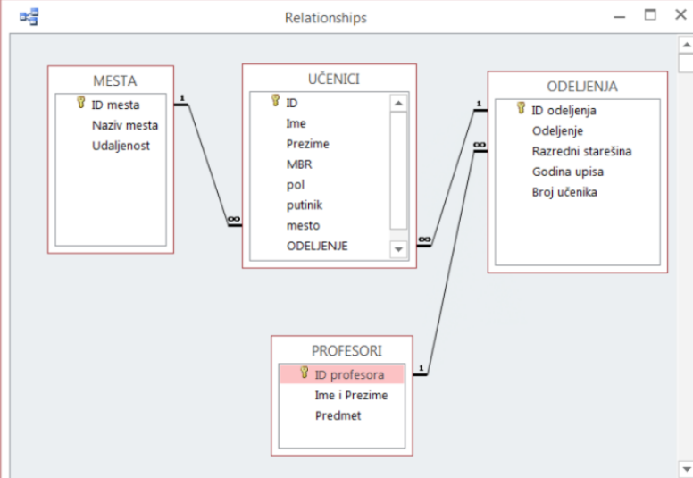

*Slika preuzeta sa [stranice](https://racunarstvoiinformatika.wordpress.com/2017/10/09/iv-razred-teorija-relacioni-model-baze-podataka-pojam-kljuca-baze-podaka/)*

#### Za rad sa relacionim bazama podataka, potrebno je da razumijemo sljedeće pojmove i veze:
* **Primary key** ili **primarni ključ** označen **zlatnim ključem ili slovima PK** , koji je po pravilu numerička vrijednost i predstavlja ID tabele. **Svaka tabela ima svoj jedinstveni identifikacioni broj ID, kako bi se mogle koristiti opcije veza među tabelama.**

* **Foreign key** ili **strani ključ** označen sa **FK**. Ako povezujemo dvije tabele, prva tabela u koju uključujemo podatak iz druge tabele mora sadržati ID druge tabele, ali se on tada naziva strani ključ.
*Vidimo na primjeru tabela **UČENICI** i **ODJELJENJA** gdje tabela **UČENICI** sadrži FK od tabele **ODJELJENJE***

#### Postoji tri tipa povezivanja između tabela:

* `1 : 1` „jedan prema jedan“ (jednom slogu prve tabele odgovara jedan slog druge tabele) ili jaka veza.
*Primjer* 

* `1 : n` „jedan prema više“ (jednom slogu prve tabele odgovara više slogova u drugoj tabeli)

* `n : n` „vše prema više“ (više slogova prve tabele je povezano sa više slogova druge tabele). Ovaj vid veze, generisaće između ovih podataka dodatnu tabelu koja sadrži podatke iz veze.

#### ACID je vazna odlika RDB
*Transaction* ili transakcija je akcija koju radimo prilikom pristupa podacima unutar baze podataka, gdje mozemo izvrsiti i modifikacije nad podacima koristeci **read** i **write** operacije.
Kako bi se zadrzala konzistentnost baze podataka prilikom svih transakcija i promjena, moraju se ispostovati odredjena pravila tj. **ACID properties**
*Vise mozete procitati [ovdje](https://www.geeksforgeeks.org/acid-properties-in-dbms/)*

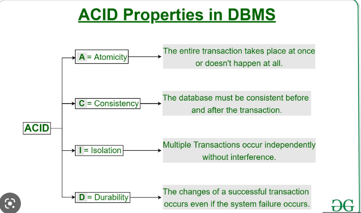

*Slika preuzeta sa [stranice](https://www.geeksforgeeks.org/acid-properties-in-dbms/)*

Za manipulisanje podacima unutar baze podataka - ispis podataka, brisanje, azuriranje podataka i sl. koriste se **UPITI**. 
Slozenost upita zavisi od toga koje podatke zelimo obradjivati, gdje se nalaze itd. Na primjer, za neke podatke je potrebno spojiti informacije iz vise tabela sto se smatra slozenijim upitom. 

#### Osnovne SQL komande 
Vise informacija pronadjite [ovdje](https://www.w3schools.com/sql/sql_syntax.asp)

* **SELECT** - za selektovanje podataka iz baze
* **UPDATE** - update podataka u bazi
* **DELETE** - brisanje podataka u bazi
* **INSERT INTO** - insertovanje novih podataka u bazu

Kao i u cloud svijetu i ovdje se tezi ka tome da se pojedini koraci automatizuju, pa tako postoje **Strored procedures**.
**Stored procedures** su procedure, blokovi koda pisani na poseban nacin gdje komande koje bismo inace kucali vise puta jednostavno zapisemo u vidu procedure, sacuvamo i samo izvrsimo onda kada su nam potrebne.


**Sintaksa store procedure**
```bash
CREATE PROCEDURE procedure_name
AS
sql_statement # upit
GO;
```
**Izvrsenje procedure**
```bash
EXEC procedure_name;
```
 Kao i bash skripte, procedure mogu biti jednostavne gdje pri pozivu ne prosljedjujemo parametre, dok mogu biti i slozenije gdje svakog proceduri proslijedimo potrebne parametre.

*Primjer - Naredni SQL statement, kreira proceduru koja selektuje Customer iz odredjenog City sa odredjenim PostalCode iz tabele Customers*
```bash
CREATE PROCEDURE SelectAllCustomers @City nvarchar(30), @PostalCode nvarchar(10)
AS
SELECT * FROM Customers WHERE City = @City AND PostalCode = @PostalCode
GO;

# izvrsenje procedure sa prosljedjivanjem parametara

EXEC SelectAllCustomers @City = 'London', @PostalCode = 'WA1 1DP';
```
Vise o Stored procedurama procitajte [ovdje](https://www.w3schools.com/sql/sql_stored_procedures.asp)

## AWS Database Services
Na slici su prikazani AWS database servisi sa kojima cemo se upoznati u nastavku.

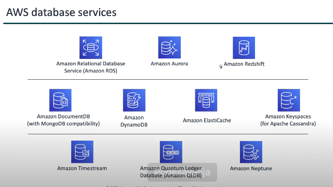
*Slika preuzeta sa Dzenanovih prezentacija*

### Amazon RDS
**Amazon RDS (Relational Database Service)** 

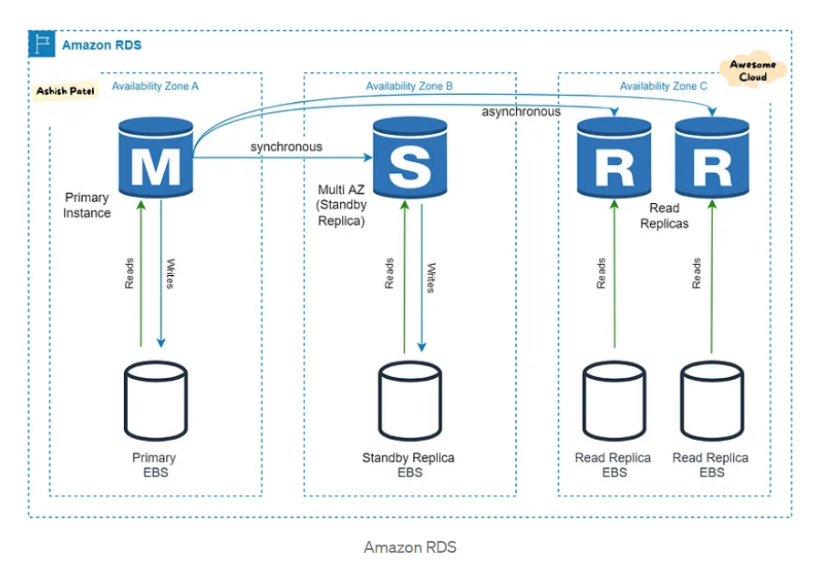
*Slika preuzeta sa [linka](https://medium.com/awesome-cloud/aws-difference-between-amazon-aurora-and-amazon-rds-comparison-aws-aurora-vs-aws-rds-databases-60a69dbec41f)*

#### Arhitektura RDS
Arhitektura RDS je slicna instalaciji baze podataka na EC2 instancu manuelnim putem, s razlikom sto provisioning i odrzavanje za nas radi AWS. 
RDS omogucava mnogo opcija kao sto su automatic failover, backup itd. 
Kako bismo postigli *reliability* tj. pouzdanost potrebno je omoguciti Multi-AZ opciju na RDS instanci, te uraditi sinhrono repliciranje  na *standby repliku* u drugoj Availability Zoni.


#### Performanse RDS
RDS koristi SSD storage za bolje I/O performanse. 
Mozemo birati izmedju dvije SSD-backed storage opcije
1. Optimized for high-performance OLTP applications
2. Cost-effective general-purpose use

#### Database Engine Support
RDS je kompatibilan sa MySQL, PostgreSQL, MariaDB, MS SQL Server i Oracle.

#### Storage 
RDS storage auto scaling automatski skalira kapacitet storage-a do 64 TiB (osim za SQL Server 16 TiB) kao odgovor na povecan workload sa 0 downtime. Za RDS Storage Auto Scaling mozemo podesiti desired maximum storage limit, a AS ce da se pobrine za ostalo.

#### Replication
RDS omogucava provisioning do 5 replika i proces je znatno sporiji u odnosu na Amazon Auroru koja omogucava provisioning do 15 replika koje su zavrsene u milisekundama.

#### Scalability 
RDS podrzava vertical scaling memorije i compute resursa up/down do maksimalnih 244GiB RAM memorije i 32vCPU.

### Amazon Aurora

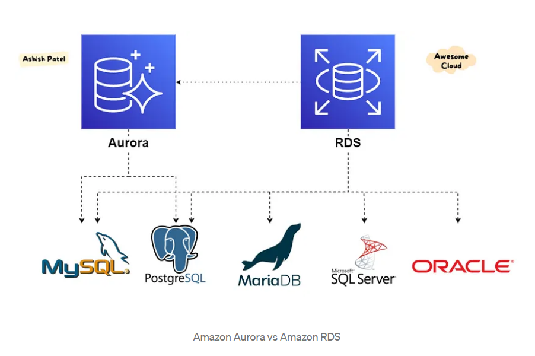
*Slika preuzeta sa [linka](https://medium.com/awesome-cloud/aws-difference-between-amazon-aurora-and-amazon-rds-comparison-aws-aurora-vs-aws-rds-databases-60a69dbec41f)*

**Amazon Aurora** je fully managed MySQL- and PostgreSQL-compatible **relaciona baza podataka** prilagodjena nacinu na koji radi **cloud** cime su poboljsane performanse.
### Amazon Redshift 

**Amazon Redshift** je data warehouse baza podataka koja koristi SQL upite za analizu struktuisanih i semi-structured podataka iz data warehouses, data lakes i operational database uz upotrebu masinskog ucenja i AWS dizajniranog harvera kako bi postigli najbolje performanse i dobili podatke u vidu izvjestaja.

### Amazon Document DB

**Amazon Document DB** ekvivalent MongoDB bazi podataka i to je **fully managed native JSON document database** cineci je jednostavnijom za developere, gdje mogu cuvati i raditi upite nad podacima u bazi koristeci isti document-model-format koji koriste i u samom kodu aplikacije.

### Amazon DynamoDB

**Amazon DynamoDB** je fully managed, serverless, key-value NoSQL database dizajnirana da podrzi izvrsenje high-performance aplikacija. DynamoDB pruza built-in security, continuous backups, automated multi-Region replication, in-memory caching, import-export alatke za podatke.

### Amazon ElastiCache

**Amazon ElastiCache** je fully managed, Redis-compatible i Memcached-compatible servis koji dostavlja real-time, cost-optimized performance za aplikacije. 
To su memorijske baze podataka, koje su u stanju da cuvaju podatke koje procitamo u svojoj memoriji sto ubrzava proces pisanja i citanja u/iz memorije u odnosu na baze koje imaju HDD. 
Memory baze podataka nemaju oznaku relacionih baza podataka, nego se koriste kao nadopuna relacionim bazama podataka.
**ElastiCache scales to hundreds of millions of operations per second with microsecond response time, and offers enterprise-grade security and reliability.**

### Amazon Keyspaces (for Apache Cassandra)

**Amazon Keyspaces** mozemo izvrsavati Cassandra workloads na AWS-u koristeci isti Cassandra application code i  developer tools koje se inace koriste.

### Amazon Timestream

**Amazon Timestream** je brza, skalabilna i serverless time-series baza podataka koja omogucava lakse cuvanje i analizu triliona eventsa/danu i do 1000 puta brze. Skalira automatski up/down kako bi prilagodila kapacitet i performance, kako ne bismo morali da se bavimo upravljanjem infrastrukturom.


### Amazon Quantum Ledger

**Amazon QLDB** je nova klasa baza podataka koje omogucavaju da pratite punu istoriju promjena nad podacima bez mogucnosti da se istorija promjeni na bilo koji nacin (alter, overwritte). Koristeci kriptografiju mozemo verifikovati da li je bilo *unintended changes* nad podacima aplikacije. QLDB koristi immutable *nepromjenjivi* transactional log - **journal**. Journal je append-only i sastoji se od sekvenci i hash-lancanih blokova koji sadrze committed data.

## Izbor prave baze podataka

Na slici su prikazane neke od razlika između SQL i NoSQL baze podataka.

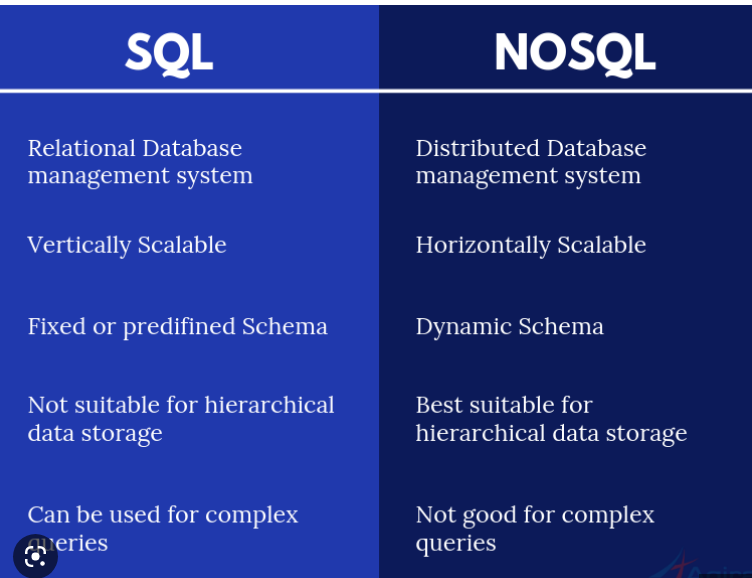
*Slika preuzeta sa [stranice](https://www.agiratech.com/the-key-differences-between-sql-and-nosql-database)*

**Relacione baze podataka SQL pros | cons**

* :white_check_mark: Zahtjevamo fiksnu semu baze podataka
* :white_check_mark: Baza ne zahtjeva ekstremne read/write kapacitete
* :white_check_mark: U slucaju kada imamo podatke koji ne zahtjevaju visoke performanse 
* :x: Mana - podrzano samo vertikalno skaliranje - mozemo samo dodavati vise resursa postojecem serveru. 
* :x: Ako jedan server padne, izgubili smo sve podatke jer se radi vertikalno skaliranje i ne postoje nodes.
* :x: Baze podataka su *hard disc intensive* imamo problem sa performansama diska i memory performansama. Kada se podaci sa diska ucitaju, oni se ne salju odmah krajnjem korisniku vec se izvjesno vrijeme zadrzavaju u memoriji database servera te je i memorija bitan faktor. 


**Nerelacione baze podataka NoSQL pros | cons**

* :white_check_mark: Sema baze podataka se moze dimanicki mijenjati po potrebni, jer se podaci cuvaju kao key-value vrijednosti
* :white_check_mark: Read/write zahtjevi prevazilaze kapacitete koje tradicionalne baze mogu pruziti
* :white_check_mark: Podrzano horizontalno skaliranje. Baze imaju vise `nodes` tj. servera na koje se nasi podaci upisuju.
* :white_check_mark: Dobra stvar kod postojanja nodova je sto je omogucena visoka dostupnost, ako se desi da jedan nod prestane sa radom, ostali imaju podatke izmedju sebe i u stanju su da nastave raditi bez jednog noda.
* :x: **Problem**: Podaci moraju da se repliciraju izmedju servera. 
    * Primjer su Youtube pregledi koji se smjestaju u NoSQL bazu, ali zbog lose sinhronizacije nodova, nemamo uvijek tacnu informaciju o broju pregleda. Pa na primjer ujutru mozemo vidjeti da video ima 1k pregleda, dok ce uvece taj broj da predje 100k. 
    
Na slici je prikazano **vertikalno vs horizontalno skaliranje**


*Slika preuzeta sa [stranice](https://www.section.io/blog/scaling-horizontally-vs-vertically/)*

## Managed i unmanaged servisi
**Managed database** je RDS servis gdje se AWS brine umjesto nas za sve oznacene dijelove, dok je na nama samo da izvrsimo *application optimization*.
**Unmanaged database** bi bila instalacija database na EC2 instanci, AWS se brine za infrastrukturu naseg servera, dok se za sve ostale stvari trebamo sami pobrinuti.

Na slici vidimo sta je to sve potrebno da uradimo sami u slucaju kada koristimo ova dva vida servisa.

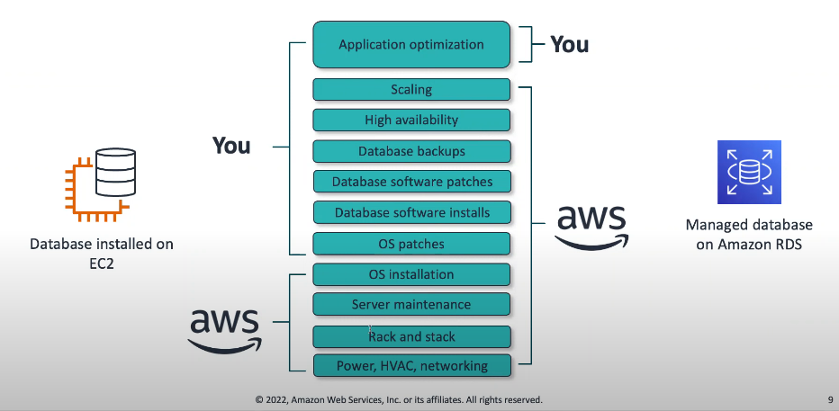
*Slika preuzeta sa Dzenanove prezentacije*

## Instalacija MySQL na EC2 instanci 
*U nastavku cemo proci kroz instalaciju MySQL baze podataka na EC2 instancu. Navedeni koraci su koraci sa predavanja koje je dostupno na [DevOps Mentorship Program - Week 9 - AWS: MySQL on EC2 vs Amazon RDS MySQL](https://www.youtube.com/watch?v=wsxwo_stIC0)*

1. Security group koji dodajemo na nasu EC2 instancu treba imati odgovarajuca inbound i outbound pravila. U nasem slucaju **inbound pravilo za SSH po portu 22 from anywhere**.
2. Potrebno je da se povezemo na nasu EC2 instancu na kojoj imamo CentOS 7 
`$ ssh -i "<naziv-kljuca>.pem centos@<ip-adresa-ec2-instance>"`
3. Instalacija baze podataka. Potrebni koraci su  [dostupni ovdje](https://dev.mysql.com/doc/mysql-installation-excerpt/5.7/en/linux-installation-yum-repo.html)

* Preuzmemo paket 
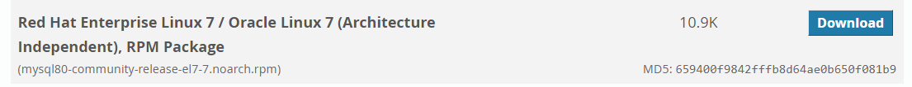

* Kopiramo link ka *No thanks, just start my download.*

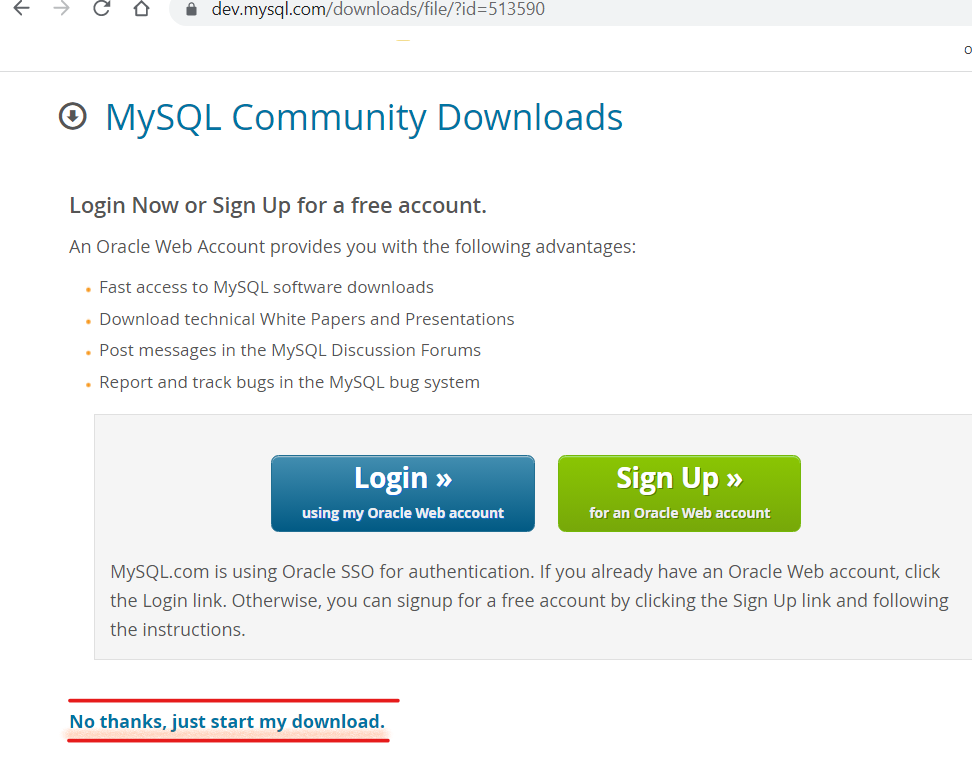

* Koristeci komandu `wget` preuzmemo paket
`$ wget https://dev.mysql.com/get/mysql80-community-release-el7-7.noarch.rpm`

```bash
$ yum update 

$ sudo yum localinstall <name-of-the-downloaded-rpm> # dodajemo repozitorij za mysql 

$ yum repolist all | grep mysql # ispisujemo repozitorije

$ sudo yum-config-manager --enable mysql-community # enable repo

$ sudo yum install mysql-community-server

$ systemctl start mysqld # pokrenemo mysql

$ systemctl status mysqld 


```
* Nakon instalacije podesimo password
```bash
$ sudo grep 'temporary password' /var/log/mysqld.log # iskopiramo sifru na kraju
```
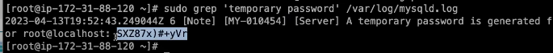
```bash
$ sudo mysql_secure_installation # secure installation
# Podesimo novi password

Dissallow root login remotely? -n
Remove test database and access to it? -y
Reload privileges tables now? -y
```
* Povezivanje na bazu i dodatne komande
```bash
$ mysql -h localhost -u root -p # unesemo privremeni password
# povezali smo se na bazu
mysql> exit # izlaz 
mysql> \! clear # clears the mysql console screen
```
Slikoviti prikaz povezivanja sa `localhost`

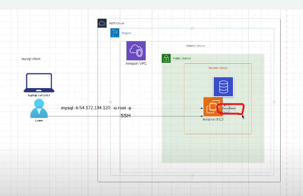
*Slika preuzeta sa DevOps Mentorship Program - Week 9 - AWS: MySQL on EC2 vs Amazon*

* Kreiranje baze podataka `week9`
```bash
mysql> show databases;
mysql> CREATE DATABASE week9; # kreiremo bazu week9
mysql> show databases;
mysql> use week9; # da koristimo ovu bazu
```
* Kreiranje tabele `korisnici` i unos podataka u tabelu
```bash
mysql> show databases;
mysql> CREATE TABLE korisnici (id int, ime varchar(255)); # kreiremo bazu week9
mysql> show tables; # prikaz tabela
mysql> INSERT INTO korisnici  VALUES (1, 'Nur'); # unos podataka
mysql> SELECT * FROM korisnici; # ispis sadrzaja tabele korisnici
```
#### Podesavanje remote povezivanja 

`$ cd /etc/my` - imamo fajloe `my.cnf` i `my.cnf.d/`
`$ vi my.cnf` gdje zapamtimo 
* `datadir=/var/lib/mysql`
* `log-error=/var/lib/mysqld.log`

Dodamo `bind-address = 0.0.0.0` kao sto je prikazano na slici ispod.
* `:wq` kako bismo sacuvali promjene

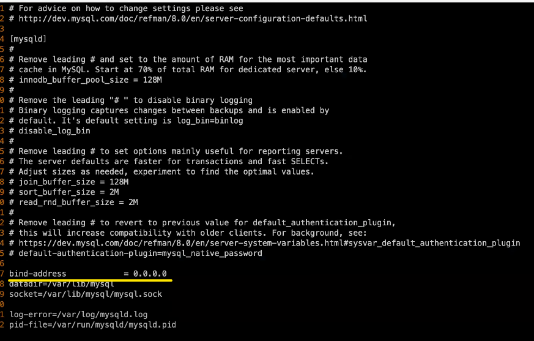
*Slika preuzeta sa DevOps Mentorship Program - Week 9 - AWS: MySQL on EC2 vs Amazon*

* Restartujemo bazu podataka
`$ service mysqld restart `

* Provjerimo Security Group za EC2 instancu i podesimo inbound rule i dodamo pravilo `MySQL/Aurora` port `3306` from `anywhere`

* Povezemo se 
`$ mysql -h localhost -u root -p`

Sada je potrebno da dozvolimo da se user `root` moze povezati sa bilo koje adrese, ne samo `localhost`.

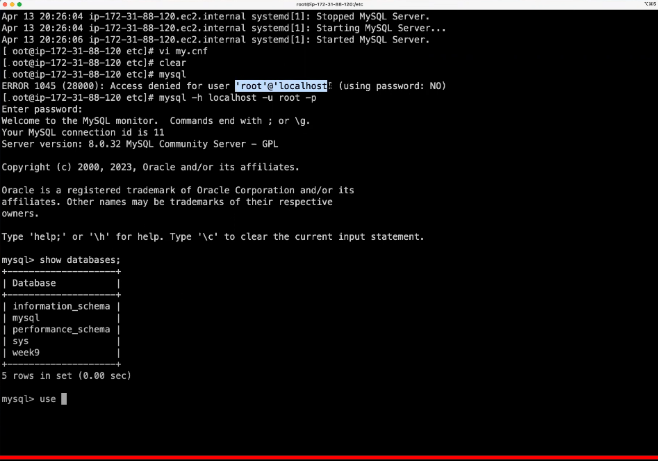
*Slika preuzeta sa DevOps Mentorship Program - Week 9 - AWS: MySQL on EC2 vs Amazon*

```bash
mysql> show databases;
mysql> use information_schema;
mysql> show tables;
mysql> select * from USER_ATTRIBUTES;
```
Prikaz rezultata komande `SELECT * FROM USER_ATTRIBUTES;`

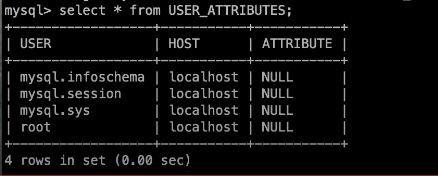
*Slika preuzeta sa DevOps Mentorship Program - Week 9 - AWS: MySQL on EC2 vs Amazon*

Sada bismo trebali update tabelu `USER_ATTRIBUTES` na nacin da imjenimo host `localhost` od `root` usera.
* Komande su:
```bash
mysql> UPDATE mysql.user SET host='%' WHERE user='root';
mysql> FLUSH PRIVILEGES;
```

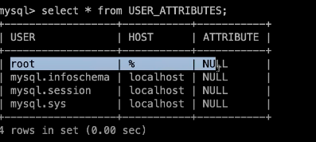
*Slika preuzeta sa DevOps Mentorship Program - Week 9 - AWS: MySQL on EC2 vs Amazon*

* Povezemo se 
`$ mysql -h <ip-adresa-instance> -u root -p`


## Amazon RDS Service 
*Kreiramo database*

1. RDS Service -> `Create database`
2. `Standard create`
3. Izaberemo koju bazu zelimo kreirati -> `MySQL`
4. Izaberemo verziju baze MySQL koju zelimo instalirati -> `MySQL 8.0.32`
5. Templates -> `Free tier`
6. U dijelu `Settings`, podesimo DB instance identifier -> `rds-week-9`
7. Master username -> `admin` i opcija `Auto generate a password`
8. U dijelu `Instance configuration` izaberemo `db.t3.micro` kao free tier opciju
9. U dijelu `Connectivity` izaberemo `Don't connect to an EC2 compute resource` i `IPv4`
10. Izabrati opciju `Public acces - Yes` da bismo mogli pristupiti sa Interneta
    * Create new VPC security group `rds-security-group-mysql-week-9`
11. Ostale stavke ostaviti kao defaultne. 
12. `Create database`


* Komanda za remote povezivanje na RDS bazu podataka 
`$ mysql -h <rds-endpoint> -u admin -p ` 
    * `-h` je `host` gdje koristimo endpoint RDS baze podataka
    * provjeriti Security Group pravila, te dozvoliti saobracaj `anywhere`

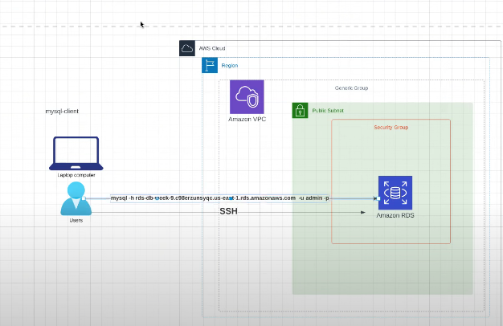
*Slika preuzeta sa DevOps Mentorship Program - Week 9 - AWS: MySQL on EC2 vs Amazon*


## 📹 Session recordings
- [**WEEK-9-tier-1-group-1 video session recording**](https://youtu.be/U7cS2TVmPtw)
- [**WEEK-9-tier-1-group-2 video session recording**](https://youtu.be/wsxwo_stIC0)

## 📖 Reading materials
#### Tuesday Class
- [📙 Amazon S3 FAQs](https://aws.amazon.com/s3/faqs/)
- [:infinity: DevOps Learning Path: Identity Access Management Service (IAM)](/aws/aws-service-notes/iam.md)
- [📙 Actions, resources, and condition keys for AWS services](https://docs.aws.amazon.com/service-authorization/latest/reference/reference_policies_actions-resources-contextkeys.html)
- [📙 Amazon S3 API Actions](https://docs.aws.amazon.com/AmazonS3/latest/API/API_Operations.html)
- [🌐  Complete AWS IAM Reference](https://iam.cloudonaut.io/)
- [📚 Effective IAM for AWS](resources/aws-books/effective-iam-for-aws.pdf)
- [📚The Practical IAM Guide](/resources/aws-books/the_practical_aws_iam_guide_v1.0.pdf)
- [📹 AWS re:Invent 2021 - A least privilege journey: AWS IAM policies and Access Analyzer](https://youtu.be/pKPiPplJNak)
- [📹 AWS re:Inforce 2022 - Security best practices with AWS IAM (IAM201)](https://youtu.be/SMjvtxXOXdU)
- [📹 AWS re:Invent 2018: [REPEAT 1] Become an IAM Policy Master in 60 Minutes or Less (SEC316-R1)](https://youtu.be/YQsK4MtsELU)
- [📹 IAM Policy Evaluation Series: AWS IAM policy language explaine - Part 1](https://youtu.be/qsF6Kauh2J4)
- [📹 IAM Policy Evaluation Series: policy evaluation chains | Amazon Web Services](https://youtu.be/71-Gjo6a5Cs)  

#### Thursday Class
- [📹 ]()


[:fast_forward: Class Notes](/devops-mentorship-program/04-april/week-9-110423/00-class-notes.md)
[:fast_forward: Additional Reading](/devops-mentorship-program/04-april/week-9-110423/02-additional-reading.md)
[:fast_forward: HOME - README.md](../../../README.md)
[:fast_forward: Sadrzaj - DevOps Learning Path](../../../table-of-contents.md)
