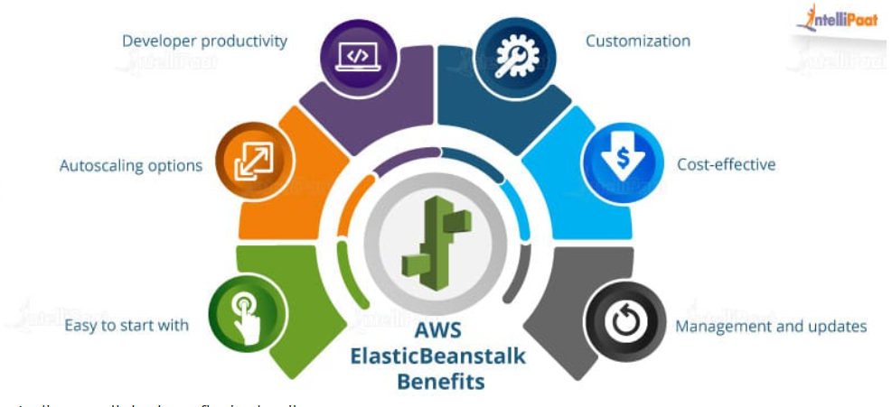

# 📝 Week 13 - Class notes
## 📅 Date: 16.05.2023.

### AWS Elastic Beanstalk

**AWS ElasticBeanstalk** omogucava brzi deploy i upravljanje aplikacijama unutar AWS Cloud-a. 
Ovime je umnogome olaksan posao developerima, koji sada mogu jednostavno uz par klikova na zeljene opcije uraditi upload aplikacije, a EB ce se pobrinuti za capacity provisioning, load balancing, auto-scaling i health monitoring.

*Slika preuzeta sa blog posta [AWS ElasticBeanstalk - Explained](https://intellipaat.com/blog/what-is-elastic-beanstalk-in-aws/?US)*

* AWS ElasticBeanstalk podrzava:
    * Java
    * .NET
    * PHP
    * Node.js
    * Python
    * Ruby
    * Go
    * Docker

* AWS Elastic Beanstalk podrzava sljedece jezike i  development stacks:

    * Apache Tomcat for Java applications

    * Apache HTTP Server for PHP applications

    * Apache HTTP Server for Python applications

    * Nginx or Apache HTTP Server for Node.js applications

    * Passenger or Puma for Ruby applications

    * Microsoft IIS 7.5, 8.0, and 8.5 for .NET applications

    * Java SE

    * Docker

    * Go

Uz mogucnost prosirenja i na ostale jezike i development stacks.

#### Sta to mozemo uraditi sa EB, sto nismo mogli prije?
AWS ElasticBeanstalk automatizuje capacity provisioning, load balancing, auto-scaling i deplojment aplikacije, kreirajuci okruzenje pogodno za pokretanje date verzije aplikacije.
Jednom kada je aplikacija deplojana, EB ce za nas raditi monitoring, basic healt-check.

* Deployment aplikacije bez izlaza iz IDE moguc je uz pomoc AWS Toolkit-a za Visual Studio i Eclipse.
AWS ce na nasem accountu kreirati S3 bucket u koji ce se upload fajlovi automatski kopirati iz lokalnog klijenta u Amazon S3. 
Opciono je moguce podesiti da EB kopira server logs svakog sata na S3.

#### Zasto korisiti AWS EB, a ne neke druge aplikacijske kontejnere ili platform-as-a-service rjesenja?

AWS EB, daje developeru potpunu kontrolu nad AWS resursima koji omogucavaju rad aplikacije. Developeri imaju slobodu da mijenjaju neke ili sve dijelove infrastrukture. 

S druge strane, vecina application containers ili platform-as-a-service rjesenja daju unaprijed predefinisane uslove te ne daju developerima odrijesene ruke po pitanju mnogo cega cime je umanjena kontrola i fleksibilnost samog developera. 

Koristenjem EB, moguce je raditi deployment web aplikacija, ali zahvaljujuci open-architecture moguc je deployment i non-web aplikacija.

#### Koje dijelove aplikacije je moguce kontrolisati ako koristimo EB?
1. Izbor zeljenog OS koji odgovara zahtjevima aplikacije (npr. Amazon Linux, Windows Server, ...)
2. Izbor EC2 instance (On-demand, Reserved, Spot instances)
3. Izbor odgovarajuce baze podataka i storage opcije
4. Omoguceno povezivanje na EC2 instancu u svrhe troubleshooting-a
5. Mogucnost podesavanja broja AZ kako bi se poboljsao reliability
6. Access logs su dostupni bez logovanja na aplikacijski server
I jos mnogo drugih.

#### Da li je moja aplikacija public?

Defaultno, kada deployamo aplikaciju koristeci EB, ona je publicly available na myapp.elasticbeanstalk.com. Koristeci VPC, mozemo odraditi kreiranje privatne izolovane sekcije za aplikaciju unutar virtual network koristeci security groups, NACLs ili custom route table. 

Takodje, moguce je dozvoliti ili onemoguciti pristup odredjenim EB resursima kao sto su aplikacije, verzije aplikacija i okruzenja. 

Za upravljanje pristupom EB servisu koristi se IAM.

### DevOps Culture and Praciices

## 📹 Session recordings
- [**DevOps Mentorship Program - Week 13 - AWS Elastic Beanstalk PART I**](https://youtu.be/X0yPX5EFMWQ)
- [**DevOps Mentorship Program - Week 13 - AWS Elastic Beanstalk PART II**](https://youtu.be/cnWsEEVU5H0)  
- [**DevOps Mentorship Program - Week 13 - Viktor Farcic - What is DevOps?**](https://youtu.be/9hAA4zw6hfE)  
- [**DevOps Mentorship Program - Week 13 - Urban Jurca - How to be successful as a DevOps? [On English]**](https://youtu.be/RJk3q6YrKlo)  

## 📖 Reading materials  
- [**AWS Elastic Beanstalk FAQ**](https://aws.amazon.com/elasticbeanstalk/faqs/)
- [**The Phoenix Project**](/resources/books/the-phoenix-project.pdf)  

[:fast_forward: Class Notes](/devops-mentorship-program/04-april/week-8-040423/00-class-notes.md)
[:fast_forward: Additional Reading](/devops-mentorship-program/04-april/week-8-040423/02-additional-reading.md)
[:fast_forward: HOME - README.md](../../../README.md)
[:fast_forward: Sadrzaj - DevOps Learning Path](../../../table-of-contents.md)
