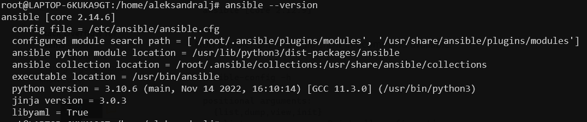
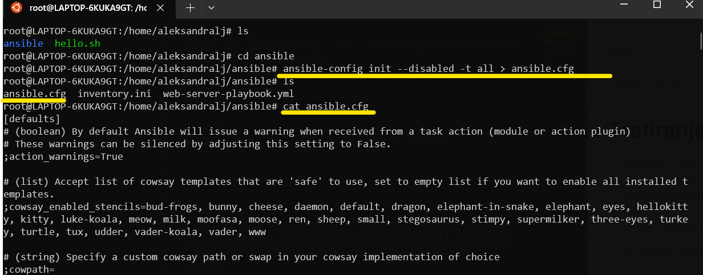

*U ovom fajlu nalaze se koraci za instalaciju Ansible na Windows Subsystem for Linux (WSL) za Windows 10  i dodatne instalacije*

# Instalacija WSL i Ansible
*Preduslovi - instaliran WSL. Verzija Ubuntu 22.04.2 LTS u mom slucaju.*

Na videu dostupnom na linku ispod imate sve potrebne korake za instalaciju kako WSL tako i Ansible. 

* [Koraci za instalaciju Ansible na WSL Windows 10](https://www.youtube.com/watch?v=4w6eVmYY-Oc&t=216s)

>**Note**
> Kako nakon ovih koraka nije kreiran Ansible config file, a nije radila ni komanda sa `init` opcijom odradite prvo sljedece korake. Vodite racuna da ste pozicionirani unutar svog usera u WSL. 

```bash
$ sudo su
$ sudo add-apt-repository --yes --update ppa:ansible/ansible
$ sudo apt install ansible
$ ansible --version
```


```bash
$ ansible-config -h # sada je init opcija dostupna
```
* Kreirati `ansible.cfg` file

`$ ansible-config init --disabled -t all > ansible.cfg`

* Output komande



>**Note**
> Sadrzaj `ansible.cfg` ne morate brisati, jednostavno zakomentarisite nepotrebne ili odkomentarisite potrebne dijelove koristeci # 


# Instalacija python3 na EC2
- Kako bi se nas `yaml` file mogao "procitati" na strani EC2 instance moramo imati instaliran python3

* Kreirati EC2 instancu sa AMI Amazon Linux 2023 i povezati se na istu.
* Instalirati python3 ukoliko ne postoji na instanci
```bash
$ sudo su 
$ python --version
$ python3 --version #ukoliko ne postoji, instaliramo 


$ yum install python 
ili 
$ yum install python3 
```
* Verzija koja je instalirana u mom slucaju
```bash
[root@ip-172-31-25-187 ec2-user]# python --version
Python 3.9.16
```
>**Note**
> Obavezno voditi racuna da svi fajlovi, direktorijumi, kljucevi budu unutar putanje navedene u nastavku tj. unutar Linux WSL particije
* Kreirati folder ansible unutar Ubuntu Linux (WSL) particije. Tacnije na putanji 
```bash
\\wsl.localhost\Ubuntu-22.04\home\<username>\<naziv-foldera>
```
   
