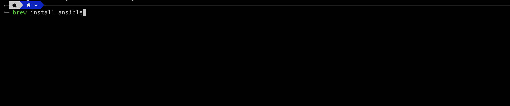
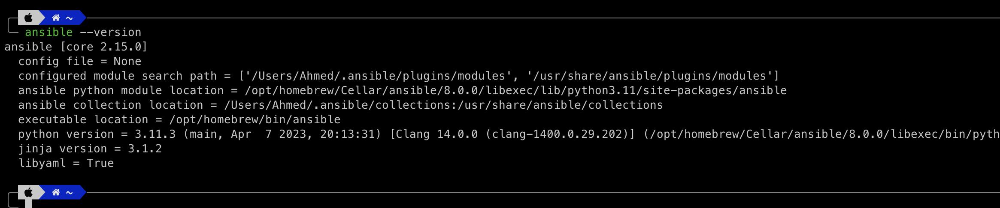

# Instalacija Ansible na macOS

## Instalacija homebrew packet managera

Za instalaciju Ansible na macOS, potreban je packet manager koji se naziva `homebrew`. 
Homebrew je besplatan open-source alat za upravljanje paketima. Omogucava jednostavno instaliranje softvera i alata koji nisu ukljuceni u osnovnu instalaciju macOS-a.

[Ovdje](https://www.youtube.com/watch?v=UBdiA0SJqLE) mozete pogledati kako instalirati homebrew.

## Instalacija Ansible 

Za instaliranje Ansible na macOS potrebno je pokrenuti komandu: 

```bash

brew install ansible

```



Pokretanjem ove komande, homebrew koji je prethodno instaliran, kroz svoju bazu podataka pretrazuje Ansible kako bi pronasao odgovarajuci paket. Nakon sto pronadje paket, homebrew preuzima potrebne datoteke i izvrsava postupak instaliranja. 

Potrebno je pricekati nekoliko minuta da se izvrsi instaliranje, a nakon toga mozemo provjeriti informacije o instaliranoj verziji Ansible kroz komandu: 

```bash 

ansible --version

```




[Ovdje](https://www.youtube.com/watch?v=qgu9g5ri1ow) mozete pogledati video kako instalirati Ansible na macOS. 

## Podesavanje terminala

Za podesavanje terminala posjetite [sljedece](https://github.com/allops-solutions/devops-aws-mentorship-program/blob/f27725afdae4d258eae42c54a907f6f9a886a507/devops-learning-path/your-laptop-setup.md).
