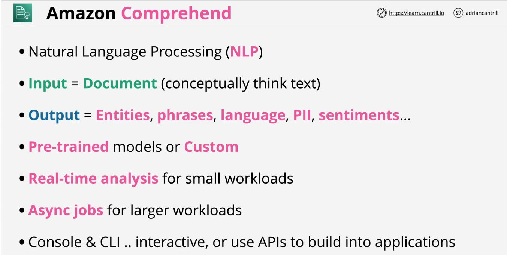
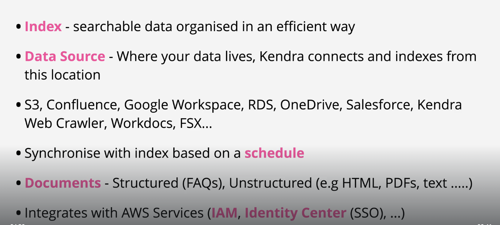
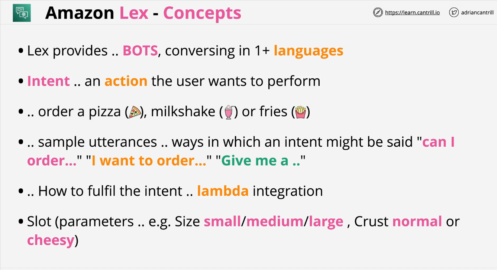
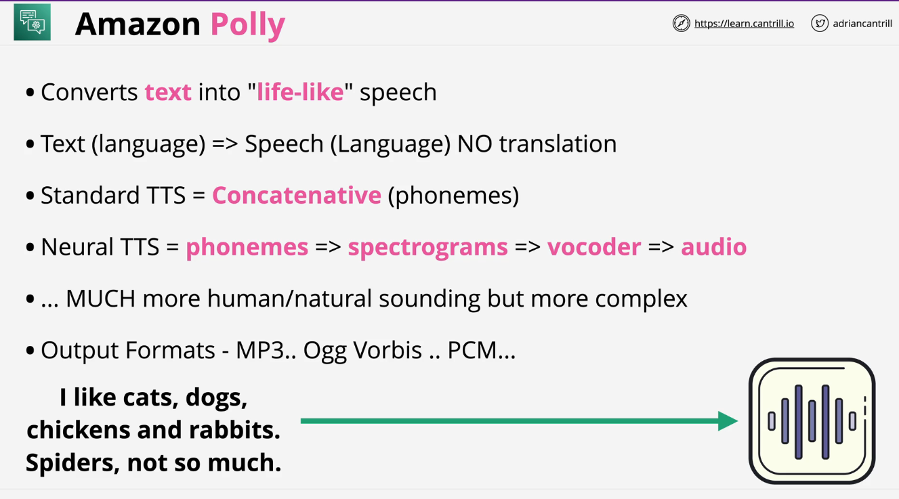
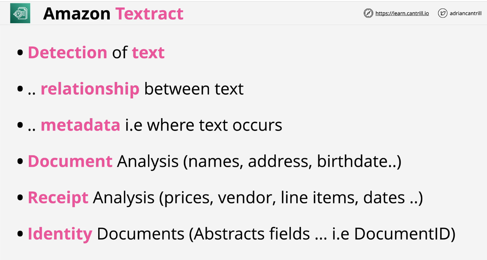
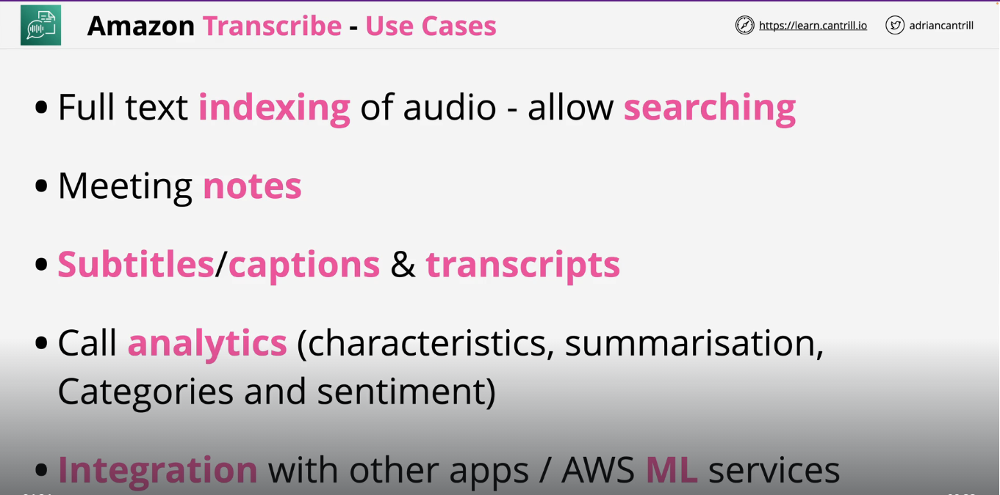
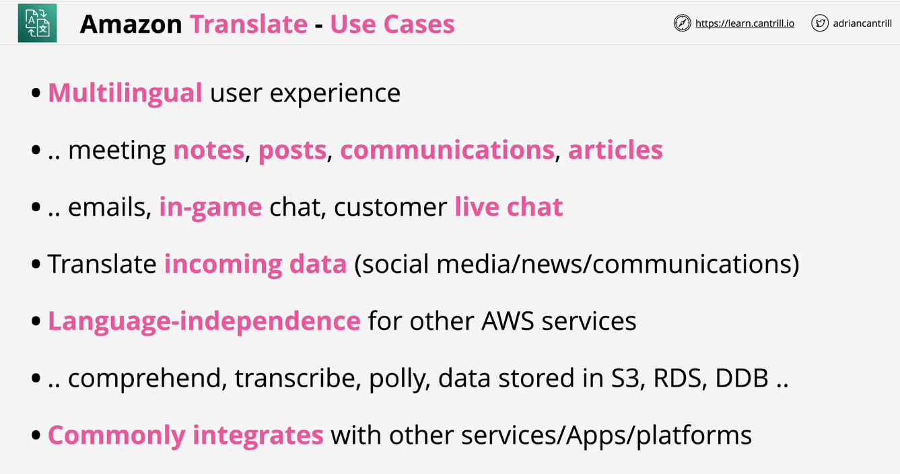
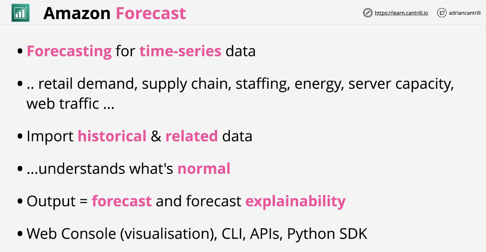
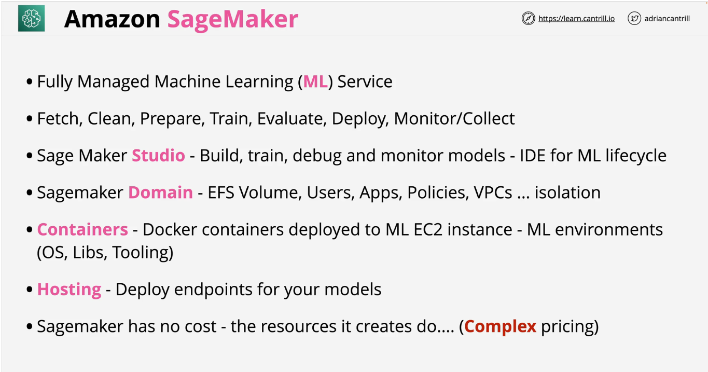

# 📝 Week 16 - Class notes
## 📅 Date: 06.06.2023.

## CDK - Cloud Development Kit

## AWS Serverless Application Model (SAM)

## Machine Learning Services on AWS
- Legenda: 
* :memo: - oznaka za napomene koje se tiču certifikacije
* :moneybag: - sekcije koje se ticu pricing-a za servise
* >*Note* - za bitne napomene koje se ticu servisa
* :mag: - definicije termina

### Machine Learning
- :mag: ***Masinsko ucenje (eng. Machine Learning)** je grana Vjestacke inteligencije (AI) i racunarskih nauka, koja koristeci modele, posebne trening i testne algoritme te setove podataka imitira stvarno funkcionisanje ljudskog ucenja, sa mogucnoscu usavrsavanja istog.*  

###  Amazon Comprehend

- Koristi se za izdvajanje termina, pojmova, rijeci, entiteta iz teksta sa odredjenom sigurnoscu
- Mogu se koristiti Built in modeli ili kreirati posebni 

>:moneybag: **Pricing**
> Per unit - formule za izracunavanje 
> - https://aws.amazon.com/comprehend/pricing/

- Vise o servisu 

*Slika preuzeta sa learn.cantrill.io*

###    Amazon Kendra
- Intelligent search servise 
- dizajniran da imitira interakciju sa ljudskim ekspertom
- Podrzava razlicite forme pitanja 
    * **Factiodna pitanja** - WHO, WHAT, WHERE?
    * **Opisna pitanja** - How to clean shoes?
    * **Keynote ili pretraga preko kljucne rijeci** - What is the keynote **address**? 

>**NOTE**
> Kendra je backend servis koji se **implementira** u aplikaciju i omogucava funkcionalnost u aplikaciji. Dakle, nije tip servisa sa kojim mozemo direktno komunicirati kao krajnji korisnik

>:moneybag: **Pricing**
> Developer Edition, Enterprise Edition

- Vise o servisu 

*Slika preuzeta sa learn.cantrill.io*

###    Amazon Lex

- fully managed artificial intelligence (AI) service sa naprednim natural language modelima koji omogucavaju  design, build, test, i deployment konverzacijskih interfejsa u aplikacijama.
- backend service koji se implementira u aplikacije za prosirenje mogucnosti
- Text or voice conversational interface koji je ugradjen u Amazon Alexa 
-  **3 glavne funkcionalnosti:**
    * **Automatic Speech recognition ASR - speech to text**
    Pomaze kod dobrog razumijevanja u odnosu na Siri IOS koji ne koristi ASR i ima dosta problema pri shvatanju i pretvaranju govora u tekst
    * **Natural language understanging NLU** - **INTENT** - **akcija koju korisnik zeli uraditi**
    Gradi intent chains koji omogucavaju sposobnost povezivanja stvari. Na primjer, ako kazemo Alexi - Zelim naruciti pizzu - intent ce biti narudzba pizze. Ako nakon toga kazemo - sa puno sira i kecapom - pravi se intent chain kako bi se znalo da se puno sira i kecap odnose na pizza narudzbu. 
    * **Build understanding into your application**
    Kao backend servis se ugradjuje u aplikacije i pomaze prosirenju mogucnosti iste.

> **NOTE**
> Skalira, integrira, quick deployment je olaksan kao i pay as you go pricing model, pa je zgodno za koristenje kod serverless arhitekture i evend driven arhitekture

>:moneybag: **Pricing**
> pay as you go pricing model

* **Za kreiranje Chatbot app, Voice assistants, Q&A bots, Info/Enterprise bots**

- Vise o servisu 

*Slika preuzeta sa learn.cantrill.io*

###    Amazon Polly

- omogucava text to life-like speech konverziju.
- Koristi se za kreiranje aplikacija koje govore, speech-enabled products i sl. 
> **NOTE**
> Nije moguc prevod texta na drugi jezik, samo na izvorni na kojem smo pisali. 

>:moneybag: **Pricing**
> Pay as you go pricing model 

- Vise o servisu 

*Slika preuzeta sa learn.cantrill.io*

* Koristi SSML *Speech Synthesis Markup Language* sto omogucava kontrolu kako Polly generise govor:
    * Pronunciation
    * Whispering
    * Newscaster speaking style itd. 

###      Amazon Rekognition

- omogucava pre-trained i customizable vision (CV) mogucnosti, sto nam omogucava da izvučemo informacije  iz slika i video snimaka
- deep learning image and video analysis
- prepoznavanje objekata sa slika i videa npr. face detection i sl.
>:moneybag: **Pricing**
> Per Image ili Per Minute kada je rijec o videu

- Analizira live video stream 

- Vise o servisu  

*Slika preuzeta sa learn.cantrill.io*

#### :memo: Ukoliko pitanje na cert. ispitu bude vezano za prepoznavanje ljudi, emocija, teksta, objekata sa slika i videa onda je odgovor AWS ReKognition sa K. 

###      Amazon Textract

- ML servis koji automatski ekstraktuje/izdvaja text, podatke i rukopis sa input dokumenata
- **Input document formati**: **jpeg**, **png**, **pdf**, **tiff**
- synchronous za manje dokumente u smislu da je real-time ekstrakcija podataka i odmah mozemo ocekivati output
- asynchronous za vece podatke (veci pdf i sl.) u smislu da se ceka zavrsetak procesa nesto duze

>:moneybag: **Pricing**
> Pay for usage, uz posebne pricing modele za velike dokumente

- Vise o servisu  

*Slika preuzeta sa learn.cantrill.io*

###  Amazon Transcribe

- Automatic Speech recognition ASR servis koji prihvata audio kao input i daje output u vidu teksta.
- moguce kreiranje rijecnika (*eng. vocabulary*) i jezickih modela (*eng. language models*)
- Jos neke mogucnosti su: filteri zbog privacy-a, speaker identification, audience-appropriate language itd.

>:moneybag: **Pricing**
> Pay for use - per second of transcribed video

- Vise o servisu:

*Slika preuzeta sa learn.cantrill.io*

###  Amazon Translate

- text translate servis koji koristi masinsko ucenje kako bi sto uspjesnije izvrsio prevodjenje teksta na zeljeni jezik rijec po rijec.
- Kako radi Translate servis?
1. Enkoder procita ulazne podatke (input text) i da nam semanticki prikaz ulaznog teksta ili jednostavnije, procita tekst i vrati nam znacenje teksta. Ovo je odlicna osobina servisa, jer znamo da prevod sa jednog na drugi jezik nikada nije direktan niti bukvalan prevod.
2. Dekoder procita znacenje teksta koje je enkoder dostavio i prevodi ga na zeljeni jezik. To je moguce koristenjem **attention mechanism** koji pomaze pri izboru pravih rijeci koje bi opisale znacenje iz enkodera. 

- Opcija **Auto detect** koja prepoznaje jezik ulaznog teksta

>:moneybag: **Pricing**
>  pay-as-you-go based on the number of characters of text that you processed

- Vise o servisu  

*Slika preuzeta sa learn.cantrill.io*

#### :memo: Ukoliko pitanje na cert. ispitu bude vezano za prevodjenje text-to-text izbor je definitivno AWS Translate servis.

###  Amazon Forecast 101

* :mag: **Machine learning forecasting** je proces koji koristi algoritme kako bi ucio iz podataka i bio u mogucnosti da predvidi buduce dogadjaje. 

- koristi 2 seta podataka
1. **Historical data**  su podaci za koje mozemo vezati neki vremenski period. Na primjer, naziv proizvoda i timestamp podaci kada je proizvod prodat i slicno.
2. **Related data** su extra podaci vezani za neki vremenski period. 
- Spajanjem ova dva seta podataka mogli bismo analizirati kada je neki proivod prodat u neko vrijeme (historical data) i udruziti te podatke sa vremenskom prognozom za taj dan (related data) kako bismo analizirali da li se zbog loseg vremena proizvod losije prodavao ili bolje. 

- Vise o servisu  

*Slika preuzeta sa learn.cantrill.io*

###  Amazon Fraud Detector

- fully managed servis za detekciju prevara ili sumnjivih aktivnosti online. 
- servis koristi masinsko ucenje i modele kako bi analizirao podatke i otkrio potencionalne sumnjive aktivnosti.
- Postoji vise modela:
1. Online Fraud - new customer account
2. Transaction Fraud - suspect payments
3. Account Takeover - phishing, social-based attack

- Funkcionalnost se zasniva na bododavnju (scored) dogadjaja te kada se isti prepoznaju dodjeli im se score. Za svaki event mozemo kreirati Rules ili decision logiku kojom odredjujemo sta i kako reagovati na score koji se pojavio za neki event. 

>:moneybag: **Pricing**
>  pay-as-you-go 

> Data processing and storage
You are charged by the Gigabyte (GB) for storing event data in Amazon Fraud Detector.

> Model Training
Amazon Fraud Detector charges for the compute hours consumed to train a custom model with your data.

> Model Hosting
Fraud Detector charges for compute capacity by the hour for on-demand hosting of deployed models, so that they are available for real-time predictions.

> Fraud Predictions
Fraud Detector chargers per fraud prediction.

###  Amazon SageMaker
- koristi se za kreiranje training models za masinsko ucenje 
- kolekcija vise AWS servisa zajedno
- Bitni pojmovi:
1. Sagemaker **Studio** - IDE for ML lifecycle
2. Sagemaker **Domain** - mozemo zamisliti kao kontejner ili logicki prostor koji kreiramo za projekte. Svaki projekat ima svoj Domain.
3. **Containers** - Docker containers 
4. **Hosting** - endpoints za modele

>:moneybag: **Pricing**
> https://aws.amazon.com/sagemaker/pricing/

- Vise o servisu  

*Slika preuzeta sa learn.cantrill.io*

## 📹 Session recordings
- [**WEEK-16-tier-1-group-1 video session recording**](https://youtu.be/_4qHTzNrCOE)
- [**WEEK-15-tier-1-group-2 video session recording**](https://youtu.be/Stjbuc2RJxc)  

[:fast_forward: Class Notes](/devops-mentorship-program/06-june/week-16-060623/00-class-notes.md)
[:fast_forward: Additional Reading](/devops-mentorship-program/06-june/week-16-060623/02-additional-reading.md)
[:fast_forward: HOME - README.md](../../../README.md)
[:fast_forward: Sadrzaj - DevOps Learning Path](../../../table-of-contents.md)
