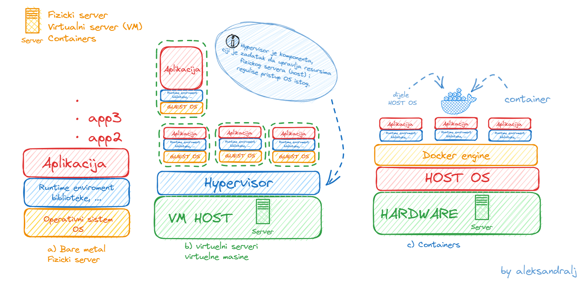
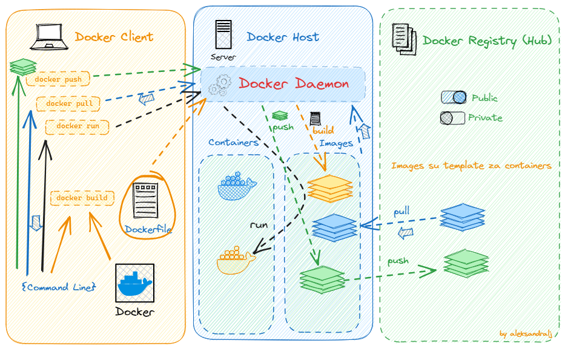
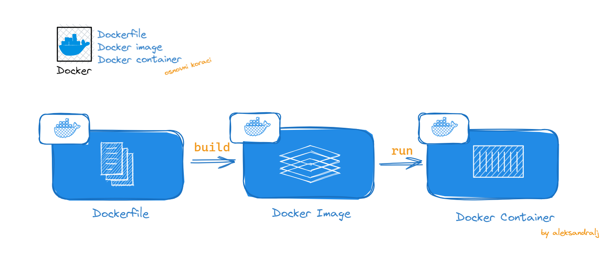

# 📝 Week 19 - Class notes
## 📅 Date: 27.06.2023.

# [](https://skillicons.dev)  Docker 


## Sta je Docker?
- Docker je open-source softverska platforma koja omogucava da radimo build, testiramo i deplojamo aplikacije, radimo update i upravljamo kontejnerima.
- Docker pakuje softver u standardizovane jedinice koje se nazivaju *kontejneri* a koji sadrze sve sto je potrebno da bi se aplikacija izvrsavala na OS ukljucujuci biblioteke, system tools, kod i runtime enviroment.

- Docker nam pomaze da prevazidjemo jedan od problema - "Ali radilo je na mojoj masini". Dakle, sa upotrebom kontejnera, omoguceno je da bilo ko i na bilo kojoj masini moze izvrsiti aplikaciju. Razlog tome je upravo kontejner, koji sadrzi sve potrebno da bi ta specificna aplikacija radila. 

## Fizicki server vs Virtuelni server (VM) vs Kontejneri
- Server je kolekcija hardverskih komponenti kao sto je maticna ploca, CPU, memorija, storage i dodatne kartice. 

- **Fizicki server** ili *Bare metal* je racunar koji radi kao server, a za ciju konfiguraciju i kapacitete smo zaduzeni sami. Dakle, mozemo da koristimo 100% kapaciteta fizickog servera ali sa druge strane, moramo i da popravimo sve sami ukoliko dodje do neke greske ili kvara.
- Na njemu imamo instaliran OS, zatim runtime-enviroment sa bibliotekama te samu aplikaciju ili vise aplikacija koje zahtjevaju iste resurse i konfiguraciju. 
- Pad jedne aplikacije, moze dovesti do kraha svih ostalih aplikacija na serveru. A potrebno je voditi racuna i o iskoristivosti resursa servera.

- **Virtualni serveri ili Virtualne masine** omogucavaju nam da na jednom fizickom serveru, koji ima svoj OS i ostale hardverske komponente (*host*), podignemo vise aplikacija sa zasebnim OS koji mogu biti razliciti od onoga koji host ima, te konfigurisati potpuno zaseban runtime enviroment za aplikaciju.
- **Prednost VM, jeste sto aplikacijama omogucava jedan vid samostalnosti i odvojenosti od drugih VM na istom host-u.** Sto znaci da ako pravilno dodijelimo resurse svim VM pokrenutim na Host-u, one ce imati svoje zasebne CPU, memoriju, OS itd. U zavisnosti od kapaciteta VM, zavisice izvrsenje i kvalitet rada aplikacije.

- Tu uvodimo i pojam **Hypervisor**
>**Note**
> Hypervisor je komponenta, ciji je zadatak da upravlja resursima fizickog servera (host) i regulise pristup OS istog.
>

- **Container** su softverske jedinice, koje su slicne VM s bitnom razlikom da ne sadrze OS u paketu vec koriste Docker engine, a svaka aplikacija u kontejnere pakuje svoje runtime-enviroment (biblioteke i sl.) i sami kod aplikacije.
- Za razliku od VM, koje imaju jedan vid samostalnosti, kvalitet izvrsenja aplikacija u ovom slucaju ce da zavisi od rada ostalih aplikacija koje su na istom Docker host-u, jer se ipak koristi isti OS. 


*Na slici su prikazane razlike izmedju fizickog servera, VM i container-a*

## Docker arhitektura i terminologija

*Slikoviti prikaz kako docker funkcionise*
- **Docker engine** je bazni engine instaliran na Docker host-u a koji radi build  i run kontejnera koristeci Docker komponente i servise 

- **Docker Client** je nacin na koji smo u interakciji sa Docker-om (Docker Desktop, Command Line i sl.). Docker Client koristi Docker API da bi poslao komande ka Docker Daemon.

- **Docker host** je fizicki ili virtuelni server na kojem se izvrsava glavna komponenta Dockera - Docker engine. Ima svoj Host OS.

- **Docker Daemon** osluskuje klijentove zahtjeve i u interakciji sa OS kreira kontejnere i upravlja istim.

- **Docker Registry** je open-source server-side servis koji se koristi kao hosting distribucija za Docker Images. **[Docker Hub](https://hub.docker.com/)** je najveci Registry za Docker Images. Images mogu biti u public ili private repozitorijima. Za interakciju sa Docker Registry mozemo koristiti `pull` i `push` komande.
`Pull` komandu koristimo da preuzmemo Image dostupan u Docker Registry.
`Push` komandu koristimo da podijelimo nas Docker Image u Docker Registry.

- **Dockerfile** je text file sa setom instrukcijama kako da uradimo build naseg  Docker Image-a.  Svaka instrukcija predstavlja sloj (*layer*) Image-a. 

- **Docker Image** je template Docker kontejnera. Images su read-only i sadrze aplikaciju i potreban enviroment za aplikaciju (runtime tools, biblioteke i sl.).

- **Docker container** je **runnable** instanca Image-a. To je standalone, executable softverski paket koji ukljucuje aplikaciju i njene dependencies. Koristeci Docker API ili CLI, mozemo startovati, stopirati ili obrisati kontejner. 


*Od Dockerfile do Docker Container*

## Dockerfile 
- Komentar u Dockerfile pocinje sa `#` ili `$`
``` # ovo je komentar ``` 
``` $ i ovo je komentar ```

- Svaka linija ima instrukcije i argumente
- **INSTRUKCIJE** se pisu **VELIKIM SLOVIMA**, kako bismo ih razlikovali od argumenata
---
- Osnovne instrukcije su:

1. **FROM** - postavimo bazni image koji koristimo za build *(npr. Alpine - lightweight Linux)*. Dodatno mozemo navesti tag za verziju.

2. **LABEL** - dodavanje metadata image-u *(opis, maintainer)*
---
- Instrukcije koje kreiraju novi **layer** Image-a. ***One layer per instruction***:

1. **RUN** - izvrsava komande u novom layer-u *(instalacija paketa, aplikacija, testovi, druga konfiguracija)*
* **output** RUN komande bice smjesten u novi layer Docker image-a
2. 3. **COPY** i **ADD** komande
* zajednicko: kopiraju nove fajlove iz src (client machine) u destination na Docker image
- **ADD** moze dodati file sa remote URL i uraditi ekstrakciju 

---

- Instrukcije u odnosu na **sta Image radi** i **kako se izvrsava/run**

1. **CMD** postavljamo **default** izvrsenje. *(default run game server)*
- aKO pri `build` ne navedemo parametre, koriste se defaultni 
- mogu biti *overridden*  ako koristimo **CMD**
- koristiti kada kreiramo *general image*

2. **ENTRYPOINT** radi isto sto i CMD, ali ne moze biti *overridden*
- koristiti kada kreiramo *single purpose image*

3. **EXPOSE** - informise Docker koji port container app koristi za izvrsenje
---
### Korisne Docker komande
```bash
# pregled aktivnih i zavrsenih procesa
$ docker ps
$ docker ps -a # pregled svih procesa i zavrsenih

$ docker run <image-name> # za pokretanje image-a

$ docker images # prikaz svih image-a

$ docker pull <ime-image-a> # da preuzmemo image sa Docker Hub

$ docker inspect <imageID> # da uradimo review metadata image-a

# port i detach from terminal
$ docker run -p x:y <image-name or image-id> # -p mapira port x koji je Docker Hub port u port y koji container koristi za pristup aplikaciji 
$ docker run -p x:y -d <image-name or image-id> # -d  detach from terminal

$ docker port <container-id> # prikazuje mapiranje portova npr. 80/tcp -> 0.0.0.0:8081

# izvrsavanje u exec mode
$ docker exec -it <CONTAINERID> ps -aux # izvrsavanje komandi unutar container-a
$ docker exec -it <CONTANERID> sh # izvrsavanje shell komandi
$ docker exec -it <CONTANERID> sh
sh-4.4# df -k # prikaz file system unutar docker container-a


# start, stop, restart 
$ docker restart <CONTAINDERID> # restart container-a
$ docker stop <CONTAINERID> # stopiranje container-a
$ docker start <CONTAINERID> # start container-a

# docker logs
$ docker logs <CONTAINERID> # prikaz logova
$ docker logs <CONTAINERID> -t # prikaz logova i -t za timestamp

# brisanje container-a
$ docker stop <CONTAINERID> # stopiramo container
$ docker rm <CONTAINERID> # obrisemo container

# brisanje image-a
$ docker images 
$ docker rmi <IMAGEID>


# tag image
$ docker build -t <naziv-taga> . # tagovanje image-a pri build-u
```
### Primjer 
- Na slici je prikazano kako od Dockerfile kreiramo image, zatim od Image-a kreiramo container.


[:fast_forward: Class Notes](/devops-mentorship-program/04-april/week-8-040423/00-class-notes.md)
[:fast_forward: Additional Reading](/devops-mentorship-program/04-april/week-8-040423/02-additional-reading.md)
[:fast_forward: HOME - README.md](../../../README.md)
[:fast_forward: Sadrzaj - DevOps Learning Path](../../../table-of-contents.md)
